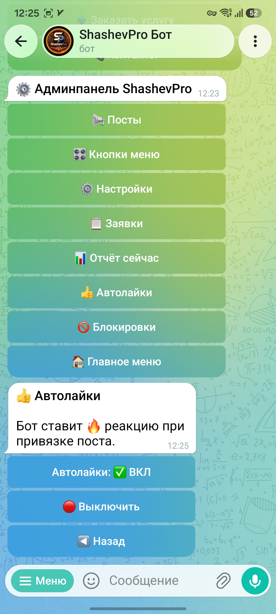
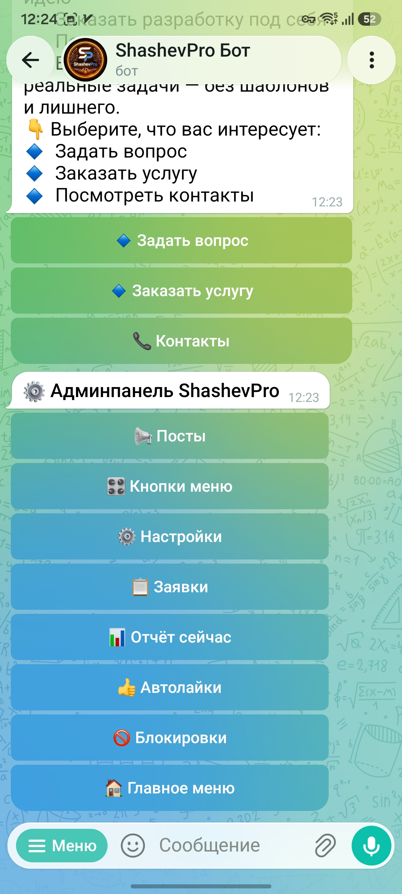
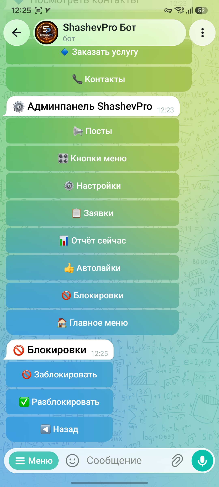
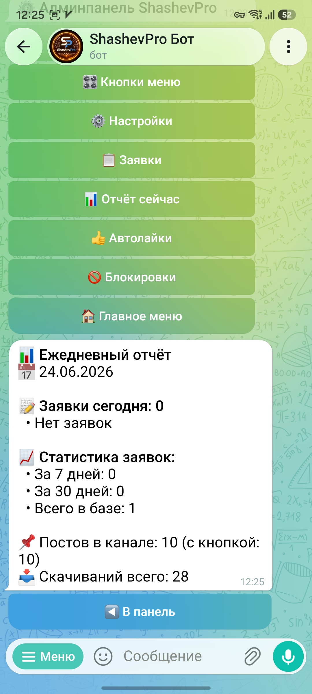
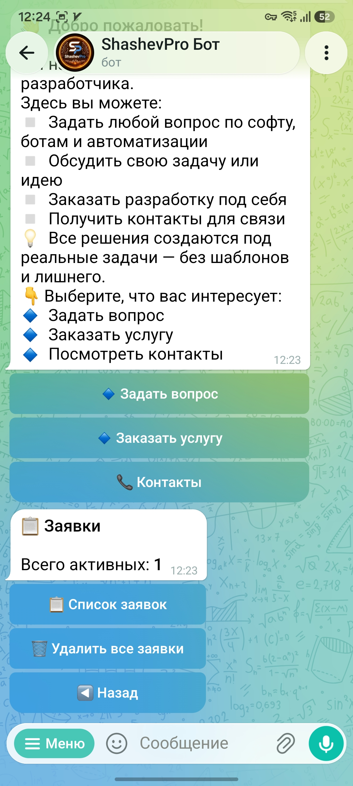
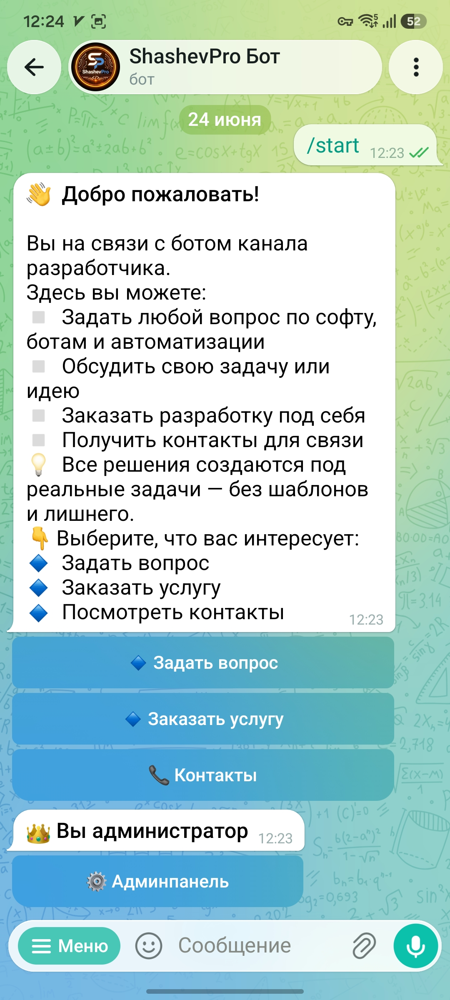
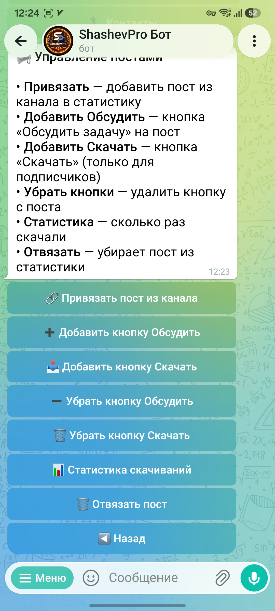
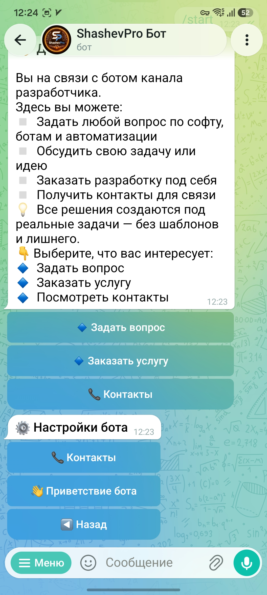
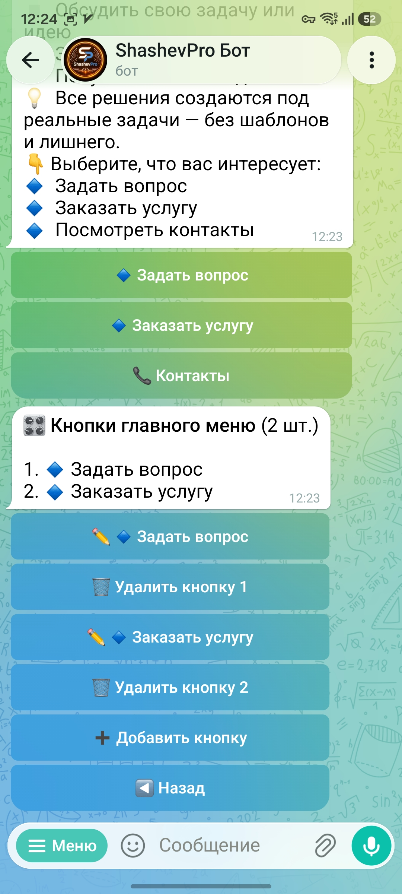

# Универсальный Telegram-бот для приёма заявок и управления каналом

### Universal Telegram bot for client requests and channel management

---

## 🇷🇺 Русский

Готовый бот для Telegram-канала и бизнеса. Принимает заявки от клиентов, управляет постами канала, ведёт статистику и позволяет администратору настраивать всё прямо из чата — без кода и серверных перезапусков.

### Для кого

Фрилансеры, малый бизнес, Telegram-каналы, агентства, онлайн-школы, консультанты, мастера, сервисные компании.

### Для клиентов

- Настраиваемое меню (до 8 кнопок) — добавить, редактировать, удалить прямо из панели
- Пошаговая форма заявки: имя → описание задачи
- Мгновенное подтверждение с номером заявки
- Кнопка «Обсудить задачу» под постами канала
- Кнопка «Скачать» под постами — выдаёт ссылку только подписчикам канала

### Для администратора

- Уведомление о каждой новой заявке с быстрой блокировкой пользователя
- Просмотр и удаление заявок из панели
- Управление постами канала: привязать пост, добавить/убрать кнопки, статистика скачиваний
- Управление кнопками главного меню: добавить, редактировать, удалить
- Настройка текстов: приветствие, контакты — без перезапуска
- Блокировка и разблокировка пользователей
- Автолайки 🔥 на посты при привязке
- Ежедневные отчёты по расписанию (с настройкой времени)
- Поддержка нескольких администраторов

---

## 🇺🇸 English

A ready-made Telegram bot for a channel and business. Accepts client requests, manages channel posts, tracks statistics, and lets the admin configure everything directly from chat — no code, no server restarts needed.

### For clients

- Configurable menu (up to 8 buttons) — managed from the admin panel
- Step-by-step request form: name → task description
- Instant confirmation with request number
- "Discuss task" button on channel posts
- "Download" button on posts — delivers the link only to channel subscribers

### For the admin

- New request notification with one-tap user block
- View and delete requests from the panel
- Channel post management: attach posts, add/remove buttons, download statistics
- Main menu button management: add, edit, delete
- Text settings: greeting, contacts — no restart required
- User blocking and unblocking
- Auto-likes 🔥 on posts when attached
- Daily reports on schedule (configurable time)
- Multiple admin support

---

## 🖥 Скриншоты · Screenshots

  
  
  

---

## ⚙️ Стек · Stack

- Python 3.10, aiogram 3.13
- YDB (Yandex Database) / PostgreSQL
- VPS Ubuntu 22.04, systemd
- Поддержка нескольких администраторов

---

## 💼 Коммерческий продукт · Commercial product

Исходный код закрыт. Поставляется под ключ, настраивается под любой бизнес за 15 минут.  
Source code is not public. Delivered as a turnkey solution, configurable for any business.

**Заказать · Order:**

- 🌐 [shashevpro.ru](https://www.shashevpro.ru)
- 🛒 [kwork.ru/user/shashevpro](https://kwork.ru/user/shashevpro)
- ✉️ programmer@shashevpro.ru
- 💬 [vk.com/shashevpro](https://vk.com/shashevpro)

---

**© ShashevPro · Andrey Shashev** — commercial software, source not public.

